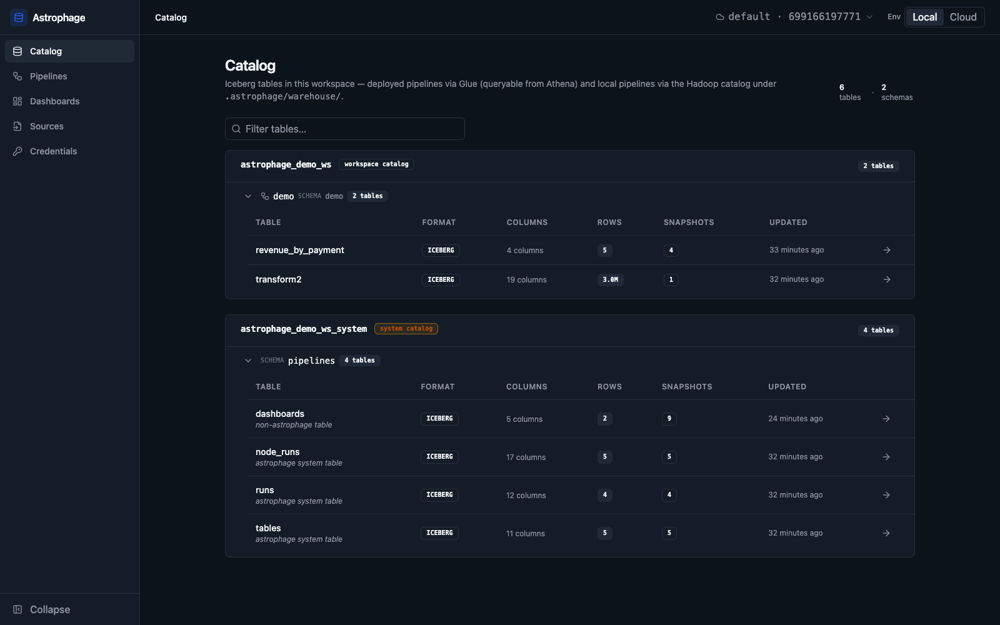
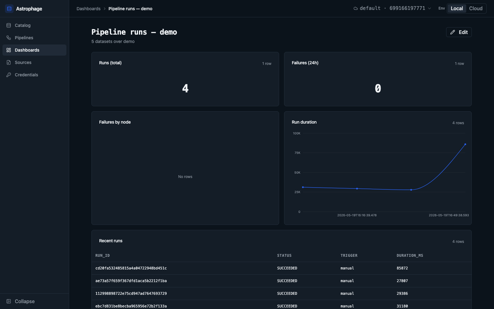
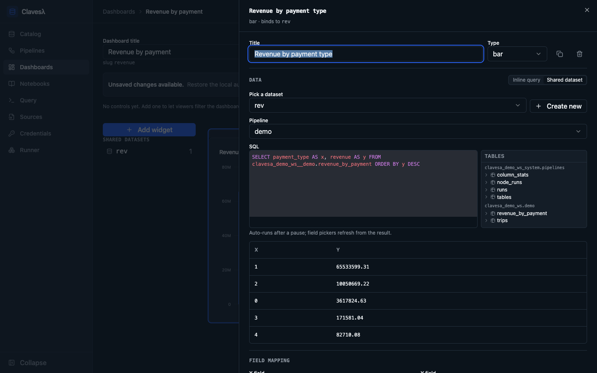
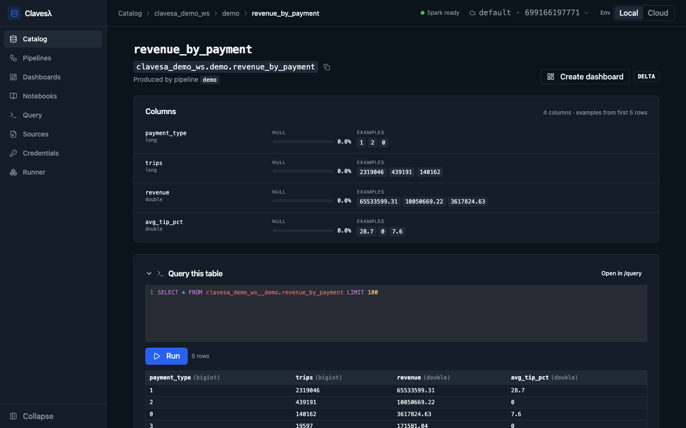
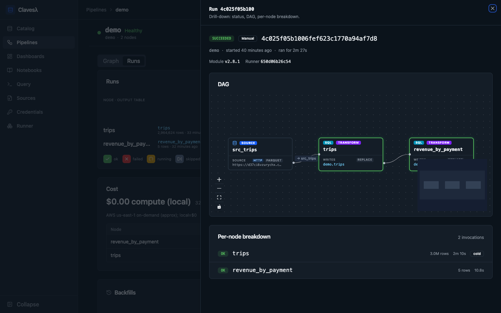

# Clavesλ

**Clavesa is a self-hosted lakehouse platform. You write transforms in SQL, or in PySpark when SQL isn't enough, and Clavesa compiles them to the cheapest AWS compute that fits: Lambda, Fargate, or EMR Serverless. The whole stack is Terraform in your repo.**



---

## What it is

A single Go binary that gives a solo engineer or a small team everything needed to operate a production data lakehouse on AWS:

- **Pipeline authoring.** Visual DAG editor and a CLI, both reading and writing the same `.tf` files. Transforms in SQL or PySpark.
- **Distributed execution.** One PySpark runtime, identical on your laptop and on AWS Lambda, Fargate, or EMR Serverless.
- **Data lakehouse.** Every transform output is an Apache Iceberg table in Glue Data Catalog, queryable from Athena with no DDL.
- **Observability.** Run history, lineage, freshness SLAs, and SQL-driven dashboards over the same catalog as your data.
- **Local-cloud parity.** Every authoring and operating capability works against deployed pipelines and against local-only ones. Develop offline; deploy when ready.

Built on AWS-native primitives (Step Functions, Lambda, S3, Glue Data Catalog) with no premium services in the data path. No Glue Jobs, no Databricks runtime, no Snowflake credits.

---

## Why this exists

Three ways to run a data platform today, each with a real tradeoff:

- **Hosted SaaS** (Fivetran, dbt Cloud, Airbyte Cloud). Fast to start, but data leaves your account, you pay per row, and nothing runs offline.
- **Hosted runtime** (Databricks, Snowflake, Dagster Cloud). Powerful, but you pay DBU- or credit-hour rates for Spark wrapped in a vendor.
- **Roll your own** (Airflow + dbt + Glue + custom catalogs). Cheap at scale, expensive in engineer-weeks, and prone to local-vs-production drift.

Clavesa is a fourth shape: a lakehouse platform you own, with the authoring ergonomics of a hosted runtime and the cost structure of rolling your own.

- **SQL-first, PySpark when SQL isn't enough.** Analytics engineers write SQL and drop to PySpark only for the transforms that need it. One language for most of the warehouse, one runtime for the rest.
- **Right-sized backend per transform.** A small filter runs on Lambda; a 100M-row join on Fargate; a multi-TB shuffle on EMR Serverless (roughly 5× cheaper than Glue at the same scale). You pick the target per transform, in the same Terraform that defines the pipeline.
- **One engine, local and cloud.** PySpark runs on Lambda, on EMR Serverless, and on your laptop. The same SQL produces the same Iceberg table in every target.
- **Observability without a second stack.** Run history, lineage, and freshness live as Iceberg tables in the same catalog as your data. Query them with the same SQL: `SELECT * FROM clavesa_<pipeline>.runs WHERE status = 'FAILED'`.

---

## Prerequisites

**To run clavesa locally** (laptop only, no AWS):

- **Docker.** The runner image executes PySpark for previews, local pipeline runs, and ad-hoc dashboard queries. Required even for fully-offline use.
- **macOS or Linux** (x86_64 or arm64). The binary is a single Go executable; no system libraries to install.

**To deploy pipelines to AWS** (in addition to the above):

- **Terraform 1.x** on your PATH.
- **AWS credentials configured** (e.g. `AWS_PROFILE` or `aws sso login`) with permission to create the resources the modules manage in the target account: Lambda, Step Functions, EventBridge, IAM roles, Glue Data Catalog, S3, ECR, CloudWatch Logs. Nothing is centrally hosted. Every resource lives in your account.

### Install

**macOS (recommended):** install via Homebrew tap, picks up updates with `brew upgrade`.

```bash
brew install vesahyp/clavesa/clavesa
clavesa version
```

**Linux:** download the prebuilt tarball for your architecture, extract, drop the binary on your PATH.

```bash
ARCH=$(uname -m | sed 's/x86_64/amd64/;s/aarch64/arm64/')
curl -L https://github.com/vesahyp/clavesa/releases/latest/download/clavesa_$(curl -s https://api.github.com/repos/vesahyp/clavesa/releases/latest | grep tag_name | cut -d'"' -f4)_linux_${ARCH}.tar.gz | tar -xz
./clavesa version
```

Direct macOS downloads from the Releases page are **unsigned**, so Gatekeeper will refuse to run them. Use `brew install` on macOS — Homebrew strips the quarantine attribute on install.

**From source** (if you'd rather build locally — see [Development](#development) for toolchain notes):

```bash
brew install mise && mise install && make build
```

---

## Quick start

### Local-only: laptop to working dashboard, no AWS

Two terminal commands to get the UI up; everything after that is point-and-click. The CLI alternative for the same flow is shown below. Both surfaces write the same `.tf`, so you can mix and match.

```bash
# From a checkout of this repo:
make build                         # produces ./bin/clavesa with embedded UI

# Pick a workspace dir (any path you like).
WS=/tmp/clavesa-demo
mkdir -p $WS

# 1. Init the workspace. Builds the runner Docker image with a content-
#    hash label so future inits skip the rebuild when nothing changed.
#    `init` also records this dir as your active workspace, so the UI
#    (and any later CLI calls) pick it up without --workspace.
bin/clavesa workspace init demo-ws --workspace $WS

# 2. Start the UI. Browser opens to the Catalog at http://localhost:8080/,
#    which renders a 3-step welcome card on an empty workspace.
bin/clavesa ui
```

Now drive the rest from the browser:

1. **Register a source.** Click **Manage sources** on the Catalog welcome card (or **Sources** in the nav). Click **Register source**. Type `src_trips` as the name, paste this URL, click **Register**:

   ```
   https://d37ci6vzurychx.cloudfront.net/trip-data/yellow_tripdata_2024-01.parquet
   ```

   That's NYC TLC Yellow Taxi trips for Jan 2024 (~50 MB / ~3M rows, CloudFront-cached, no auth). The runner fetches it at execution time. Nothing is staged.

2. **Create a pipeline.** Back on the Catalog welcome card click **Create a pipeline** (or **Pipelines** in the nav → **New pipeline**). Name it `demo`. Clavesa lands you in the editor for the new pipeline.

3. **Add the raw landing transform.** In the left palette, type `trips` into the **Node name** field, then click **+ SQL Transform**. Click the new transform to select it, scroll to the **Output** section in the right config panel, and tick **Compute column stats** — that opts this table's outputs into a per-column profile (null %, distinct count, top values, min/max, p50/p95) that renders on its catalog page.

4. **Wire and write the landing SQL.** In the right panel, **Inputs** → **Add**. The **Source** dropdown is pre-populated with `src_trips`; alias defaults to `src_trips`. Click **Attach**. Paste this in the SQL editor below and click **Save**:

   ```sql
   SELECT * FROM src_trips
   ```

   The `trips` transform passes the full NYC TLC schema through to its own Iceberg table — that's what gives the column profile something interesting to show.

5. **Add the aggregation transform.** Back in the palette, type `revenue_by_payment` → **+ SQL Transform**. Select it, **Inputs** → **Add**, wire `trips` (alias `trips`), **Attach**. Paste and **Save**:

   ```sql
   SELECT
     payment_type,
     COUNT(*) AS trips,
     ROUND(SUM(total_amount), 2) AS revenue,
     ROUND(AVG(tip_amount / NULLIF(fare_amount, 0)) * 100, 1) AS avg_tip_pct
   FROM trips
   GROUP BY payment_type
   ORDER BY revenue DESC
   ```

6. **Run it.** Click the `demo` breadcrumb in the editor header to open the pipeline dashboard, then click **Run pipeline**. ~30–60s end-to-end including Spark cold start. When the run finishes the page auto-navigates to the run detail view, where the DAG shows both transforms marked **ok** and the per-node breakdown is populated.

7. **Browse the result.** Click **Catalog** in the nav. Two new Iceberg tables show up under your `demo` pipeline — open `trips__default` first: schema + sample rows + the **Column profile** card with one row per column showing null %, distinct count (a handful for `payment_type`, millions for `tpep_pickup_datetime`), top-K bars where the cardinality is low, and p50/p95 for numeric columns like `fare_amount` and `total_amount`. Then `revenue_by_payment__default` for the aggregated view (no column profile here — that transform didn't opt in). Run the pipeline two more times (back to the dashboard, **Run pipeline**) to get more than one data point on the seeded `/dashboards/pipeline-runs-demo` duration chart.

#### Or: drive everything from the CLI

Same pipeline, terminal-only. CLI and UI write the same `.tf` (per [ADR-015](docs/decisions/015-cli-ui-parity.md)). Pick whichever surface you prefer, or use both:

```bash
# After steps 1-2 above (workspace init + ui), in another terminal:

# Register the same source.
bin/clavesa source register src_trips \
  --from https://d37ci6vzurychx.cloudfront.net/trip-data/yellow_tripdata_2024-01.parquet

# Create the pipeline.
bin/clavesa pipeline create demo

# Raw landing transform — full schema passthrough, with the per-column
# profile turned on so the catalog page shows null %, distinct, top
# values, percentiles.
bin/clavesa node add demo --type transform --name trips
bin/clavesa source attach demo src_trips --to trips --as src_trips
bin/clavesa node edit demo trips \
  --set "sql=SELECT * FROM src_trips" \
  --output-stats

# Aggregation transform reading from trips.
bin/clavesa node add demo --type transform --name revenue_by_payment
bin/clavesa node connect demo --from trips --to revenue_by_payment
bin/clavesa node edit demo revenue_by_payment \
  --set "sql=SELECT payment_type, COUNT(*) AS trips, ROUND(SUM(total_amount), 2) AS revenue, ROUND(AVG(tip_amount / NULLIF(fare_amount, 0)) * 100, 1) AS avg_tip_pct FROM trips GROUP BY payment_type ORDER BY revenue DESC"

# Run.
bin/clavesa pipeline run demo
```

Working in multiple terminals or switching between workspaces? Use either:

```bash
export CLAVESA_WORKSPACE=$WS    # per-shell override
bin/clavesa workspace use $WS   # switch the recorded active workspace
```

Here's what you'll see in the UI once the pipeline has run. The Catalog (top of this README) is the landing page. The seeded `/dashboards/pipeline-runs-demo` is populated by the runs. Re-run the pipeline a couple more times to get more than one data point in the duration line chart:



The two output tables (`trips__default` and `revenue_by_payment__default`) live at `/tables/<db>/<table>`. Each page shows schema, sample rows of real NYC TLC trip data, snapshot timeline (one append per run), and a lineage panel showing upstream sources and transforms. `trips__default` also renders the per-column profile card — null %, distinct count, top-K bars, percentiles for numerics — because the transform opted in via the **Compute column stats** checkbox. Clicking any run row in the pipeline dashboard opens the per-execution view with the DAG colored by per-node status and a per-node breakdown.

### Author your own dashboard

Dashboards live in the `dashboards` system Iceberg table, shared with everyone who has workspace access, in the same catalog as your data. From `/dashboards` click **New dashboard** to open the editor.

The editor splits authoring into two tabs. Under **Datasets**, add one or more named SQL queries; each query picks its own pipeline, so one dashboard can blend tables from several pipelines and mix local with cloud. A catalog browser sits beside the SQL editor: click a table or column to insert its identifier, then hit **Run** for an inline preview of the result before saving. Under **Widgets**, **Add widget** opens a type picker with six types (big number, line, bar, stacked bar, bar + line, table); each widget binds to a dataset and picks its fields from that dataset's actual result columns. Drag a widget on the layout grid to move it, or drag its corner to resize. **Save** writes the whole dashboard back to the system table.



A dashboard is just a spec of datasets and widgets, so the CLI authors the same thing: `clavesa dashboards apply <file>.json` writes one from a file, with `list` / `show` / `render` / `delete` rounding out the surface (ADR-015 parity). The spec is portable across compute targets — Athena and the local runner answer identical SQL, so the same dashboard works against a cloud-deployed pipeline and a local one.

### Deploy to AWS

Each workspace's `main.tf` creates its own S3 bucket and ECR repo and pushes the runner image. Nothing centrally hosted; nothing leaves your account.

```bash
# Deploy the workspace (S3 bucket, ECR repo, runner image push, system catalog).
AWS_PROFILE=my-account bin/clavesa workspace deploy --workspace $WS

# Deploy the pipeline (transform Lambda, Step Functions, IAM).
AWS_PROFILE=my-account bin/clavesa pipeline deploy demo --workspace $WS

# Trigger a cloud execution. `pipeline run` dispatches by the workspace
# environment mode (default "local"); --env cloud overrides it for this
# run and starts the deployed Step Functions execution.
AWS_PROFILE=my-account bin/clavesa pipeline run demo --env cloud --workspace $WS
```

To operate against the cloud deployment by default — so `pipeline run`, the dashboards, and the catalog all read the deployed pipeline without a per-command flag — switch the workspace into cloud mode: `clavesa workspace use --env cloud`. Switch back with `--env local`. The mode is per-workspace and gitignored.

Both deploy commands wrap `terraform init -upgrade → plan -out=tfplan → apply tfplan` with a preflight that checks AWS credentials (via `sts:GetCallerIdentity`) and — for `workspace deploy` — verifies the local runner image matches the embedded sources before pushing. The saved plan pauses for a `yes` confirmation by default; pass `--yes` for non-interactive runs and `--plan-only` to stop after `plan`. Tear down with `clavesa pipeline destroy <pipeline>` (sweeps runtime-created Glue tables first) then `clavesa workspace destroy`.

The pipeline's run history shows up in the same `/dashboards` UI. Response shapes are identical; widgets are interchangeable between cloud and local.

---

## Screenshots

**Browse any table in the catalog.** Schema, sample rows, snapshot history, and a lineage panel for every Iceberg table the workspace produces. Athena pulls sample rows in the cloud and PySpark pulls them locally, against identical SQL.



**Triage any run.** DAG colored by per-node status, module version and runner image digest, per-node row counts and durations, and inline log excerpts when a step fails.



---

## Documentation

- **[CHANGELOG.md](CHANGELOG.md)** lists what shipped in each release, in user-facing terms.
- **[docs/architecture.md](docs/architecture.md)** covers system layers and the data model.
- **[docs/decisions/](docs/decisions/)** holds the ADRs. ADR-012 (PySpark engine), ADR-013 (Iceberg), and ADR-014 (local-cloud parity) are the current architectural anchors.

## Development

Toolchain pinned via `.mise.toml`:

```bash
brew install mise
mise install      # installs Go and Node versions
make dev          # backend :8080 + frontend :5173 with hot reload
make test         # all suites: go + python + cli
```

To drive the dev UI against a real workspace, walk the [Quick start](#quick-start) above against a tempdir and point the frontend at it: `http://localhost:5173/?dir=<your workspace path>`.

## Contributions

Issues and bug reports welcome on [GitHub](https://github.com/vesahyp/clavesa/issues). Not accepting code contributions at this time — drive-by PRs will be closed politely.

For security issues see [SECURITY.md](SECURITY.md).

## License

[MIT](LICENSE). Copyright (c) 2026 Vesa Hyppönen.
